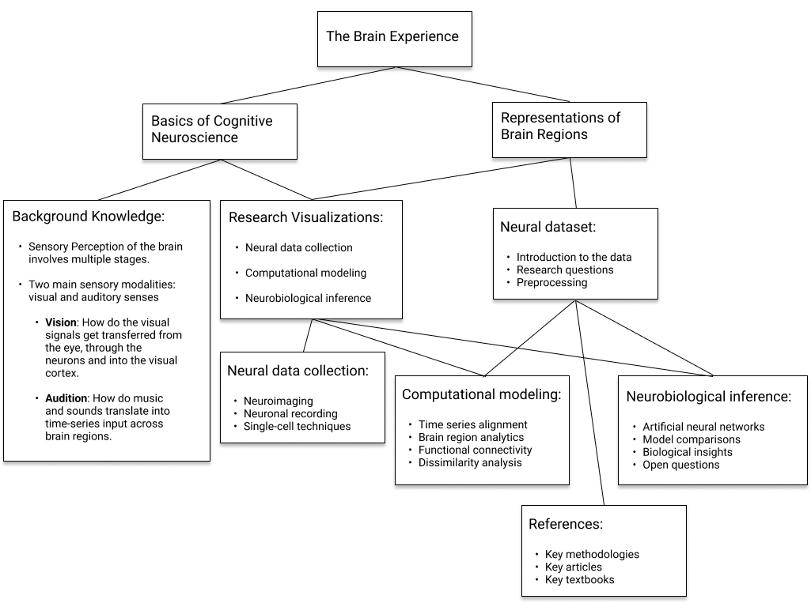

# The Brain Experience

By Baihan Lin &copy; 2022, All Rights Reserved.

*Which brain regions light up at which moments when seeing which images or listening certain music? And inversely what do brain imagine seeing or hearing given certain types of neural responses?*

  

  

In The Brain Experience, the data visualization enables the users to experience how human brains perform complicated tasks that we as people find easy. The mechanisms and processes beneath it, surprisingly, are highly complex and involve many organic elements. The projects can help the users unravel these beautiful mysteries that intrigue scientists and philosophers for ages. The cognitive tasks specific for this visualization are mostly likely to be either viewing images or listening to music.

  

  

**Research Topics**:

This project will:

- introduce the foundations of the perception process of the brains with visual storytelling and 
- visualize the dynamic process of how different brain regions interact to perform these cognitive tasks, 

  

  

**Research Significance**:

in order to help thereaders understand *how the human brains process information in an organized, systematic and hierarchical way*, so that they can:

1. have a knowledge of the underlying mechanisms when they perform daily tasks; 
2. gain access to one of the research frontiers in the fields of cognitive and computational neuroscience;
3. come up with new research questions and pursue a scientific research; 
4. build better neural network structures inspired by these neuroscientific discoveries; and 
5. revisit their philosophical stances of life about how our consciousness and thinking processes are formed. 

  

  

**Research Outline**:

**References** (ongoing):

- Lin, Baihan, et al. "Visualizing representational dynamics with multidimensional scaling alignment." *arXiv preprint arXiv:1906.09264* (2019).

