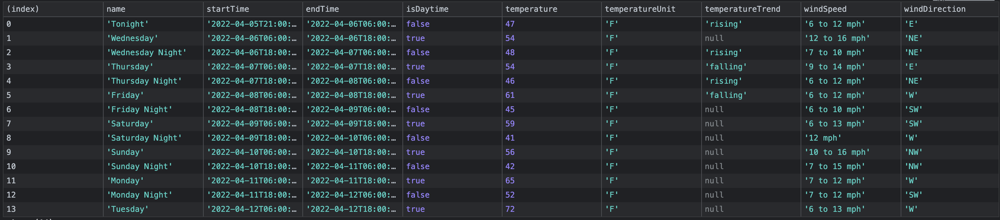

## Lab 8

**Note**: This project makes use of the `svelte-app` and `vue-app` directories in the top level of this repo.

### Objective

**Apply strategies to debug Vue and Svelte applications**

- Use general JavaScript tools like `console.log()` and `debugger`
- Use browser tools like the `Elements` and `Network` tabs
- Use framework-specific tools: [Vue devtools](https://chrome.google.com/webstore/detail/vuejs-devtools/ljjemllljcmogpfapbkkighbhhppjdbg/related) and the Svelte [@debug tag](https://svelte.dev/tutorial/debug).

### Tasks to try

- What inline styles are applied to the elements that make up the `el-slider` component in the Vue app and the SMUI slider (`.mdc-slider`) in the Svelte app? Try manually editing the inline styles to see what changes.
- Put a `debugger` statement in the `updated` (Vue)/`afterUpdate` (Svelte) lifecycle methods. What variables do you see in the local scope? What about the global scope?
- You want to make sure your app still works if the Weather API is down. Use the Network tab to (temporarily) block all requests from the domain `api.weather.gov`.
- What other methods can you use in the `console` besides `log`? Figure out how to get this table of forecast data to appear in the console:

