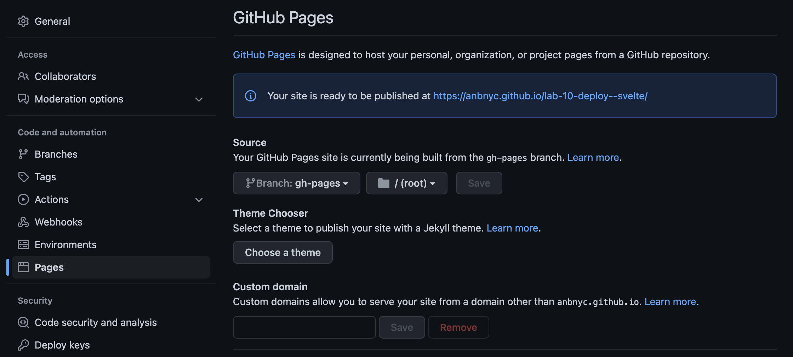

## Lab 10

**Note**: This project makes use of the `svelte-app` and `vue-app` directories in the top level of this repo.

### Objective (Part 1)

**Deploy to GitHub pages by building locally and pushing to the `gh-pages` branch**

1. Change your repo's settings to deploy to GitHub pages:



2. Make framework-specific configurations

| Vue                                                     |
| ------------------------------------------------------- |
| Create a `vue.config.js` (or update your existing one): |

```
module.exports = {
    publicPath: process.env.NODE_ENV === 'production'
        ? '/major-studio-2/'
        : '/'
}
```

| Svelte                                                                   |
| ------------------------------------------------------------------------ |
| In `index.html`, update imports to use the relative `./path` not `/path` |

```
	<link rel='icon' type='image/png' href='./favicon.png'>
	<link rel='stylesheet' href='./global.css'>
	<link rel='stylesheet' href='./build/bundle.css'>

	<script defer src='./build/bundle.js'></script>
```

3. Copy the shell script from this lab to your app root. Run it with a local variable for your thesis repo's remote URL. For example:

```bash
URL=https://github.com/visualizedata/major-studio-2 bash local-build-vue.sh
```

_or_

```
URL=https://github.com/visualizedata/major-studio-2 bash local-build-svelte.sh
```

### Objective (Part 2)

**Deploy to GitHub pages by configuring GitHub Actions to build and deploy for you**
