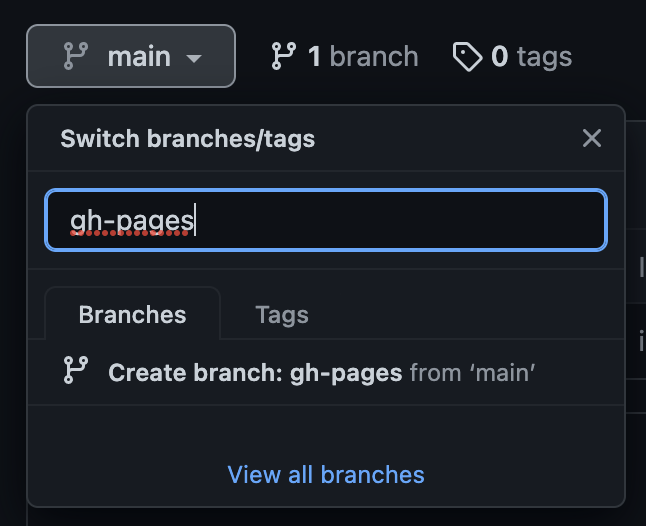

## Lab 10

**Note**: This project makes use of the `svelte-app` and `vue-app` directories in the top level of this repo.

### Objective (Part 1)

**Deploy to GitHub pages by building locally and pushing to the `gh-pages` branch**

1. If it doesn't already exist, create a `gh-pages` branch. Then change your repo's settings to deploy to GitHub pages:




2. Make framework-specific configurations

| Vue                                                     |
| ------------------------------------------------------- |
| Create a `vue.config.js` (or update your existing one): |

```
module.exports = {
    publicPath: process.env.NODE_ENV === 'production'
        ? '/major-studio-2/'
        : '/'
}
```

| Svelte                                                                   |
| ------------------------------------------------------------------------ |
| In `index.html`, update imports to use the relative `./path` not `/path` |

```
	<link rel='icon' type='image/png' href='./favicon.png'>
	<link rel='stylesheet' href='./global.css'>
	<link rel='stylesheet' href='./build/bundle.css'>

	<script defer src='./build/bundle.js'></script>
```

3. Copy the shell script from this lab to your app root. Run it with a local variable for your thesis repo's remote URL. For example:

```bash
URL=https://github.com/visualizedata/major-studio-2 bash local-build-vue.sh
```

_or_

```
URL=https://github.com/visualizedata/major-studio-2 bash local-build-svelte.sh
```

### Objective (Part 2)

**Deploy to GitHub pages by configuring GitHub Actions to build and deploy for you**

- Configure [GitHub Actions](https://docs.github.com/en/actions/deployment/about-deployments/deploying-with-github-actions) by adding a `.github/workflows/main.yml` file in your repo. This can be configured to run one or more jobs based on specific triggers, such as pushing commits to the `main` branch.
- We are using a [third-party package](https://github.com/crazy-max/ghaction-github-pages) that takes care of some of the steps we ran locally in our bash files in Part 1
- GitHub Actions runs our code in a virtual environment, and outputs logs similar to what you would see in a terminal when we run `npm install` or `npm run build` locally. If your job fails (indicated by a red X), inspect the logs to try to understand why it failed.
