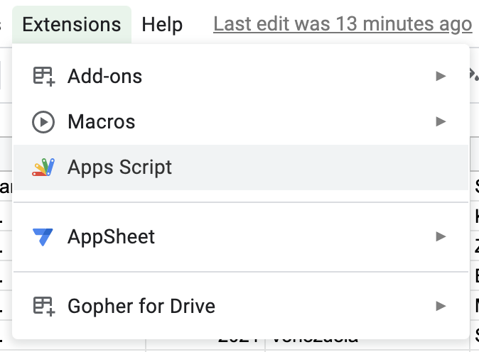
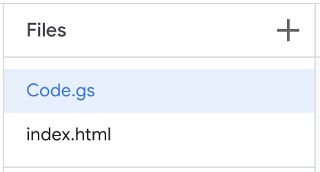
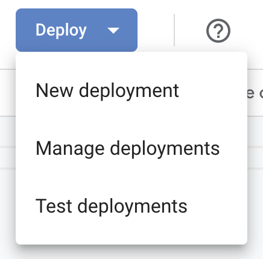
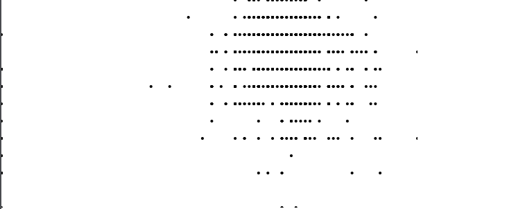

## Bonus lab: D3 on Google Sheets

### Objective

Understand how to run custom JavaScript, including d3.js, using Google Sheets as a data source.

Some context: Google Apps Script lets you write web apps in a sandboxed environment with access to custom services that can interact with Google Drive. You only need two types of files: a "server" file called `Code.gs` (which is written in a flavor of JavaScript) and a "client" file called `index.html`, which is a regular HTML file that can include `<script>` tags for JS and `<style>` tags for CSS, _plus_ it can make special calls to the server file with `google.script.run`. See [https://developers.google.com/apps-script/overview](https://developers.google.com/apps-script/overview) for documentation.

### Setup

1. From your Google Sheet, go to Extensions -> Apps Script.

   

2. Copy the files from the `/src` folder in this repo into the Apps Script environment.

   

3. Update the spreadsheet ID in line 7 of `Code.gs` with the ID of your Google Sheet. The ID is the string between `/d/` and `/edit`, for example the ID below is `abcd1234`:

```
docs.google.com/spreadsheets/d/abcd1234/edit#gid=0
```

3. Click the Deploy button to and select New Deployment. You will need to give the app permission to access your Google Drive. You can set it so only your account has access the app.

   

   Once you have created your first deployment, you can use a Test Deployment as you are developing your project in order to see changes. When you click Test Deployment you will see a link that ends in `/dev`, for example:

```
script.google.com/a/macros/newschool.edu/s/wxyz9876/dev
```

### Demo

If you make a copy of [this Google Sheet](https://docs.google.com/spreadsheets/d/10HYjH0LCrsG5KGkgrlqoUvn9OzIfn_ZPDxM_zWftpog/edit?usp=sharing) containing reviews of chocolate bars from [Flavors of Cacao](http://flavorsofcacao.com/chocolate_database.html), and follow the instructions above, you should be able to see a rudimentary SVG scatterplot drawn with D3 in your app.

   
